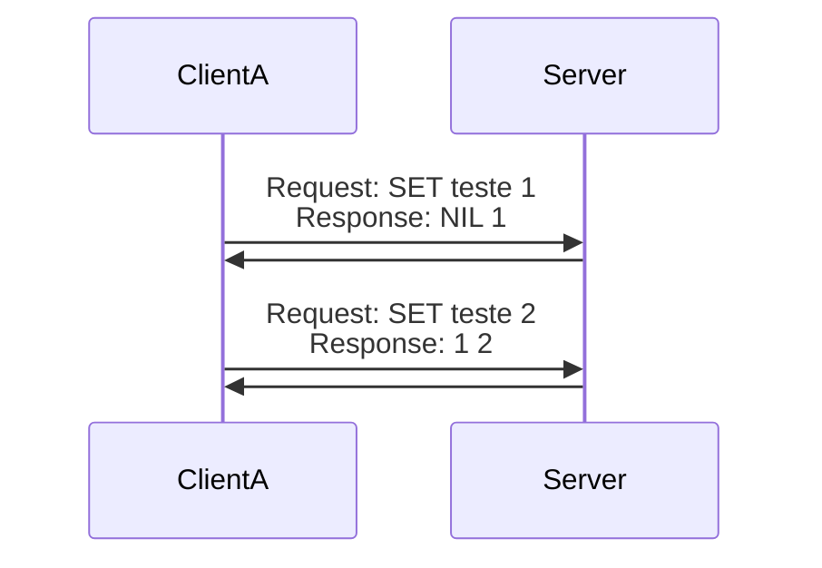
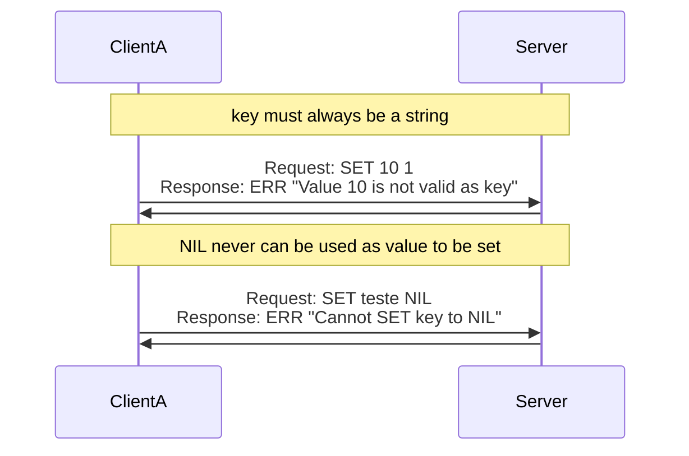
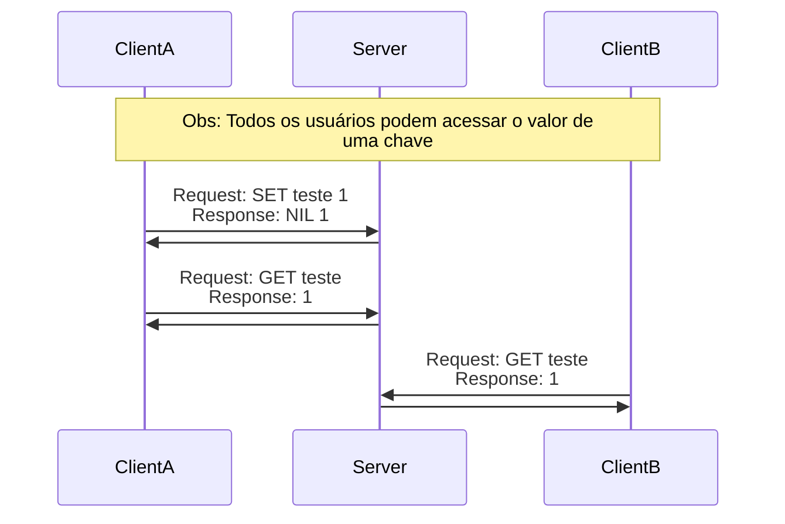
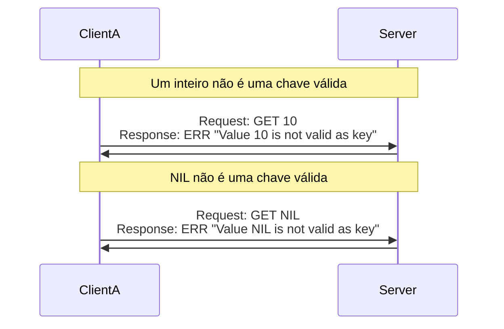
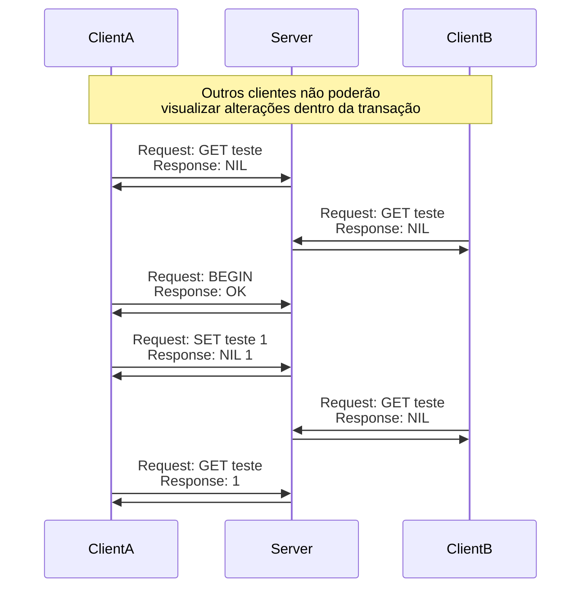
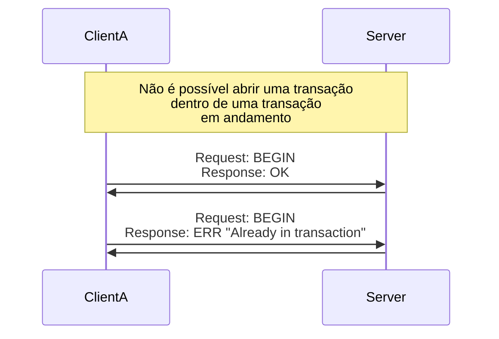
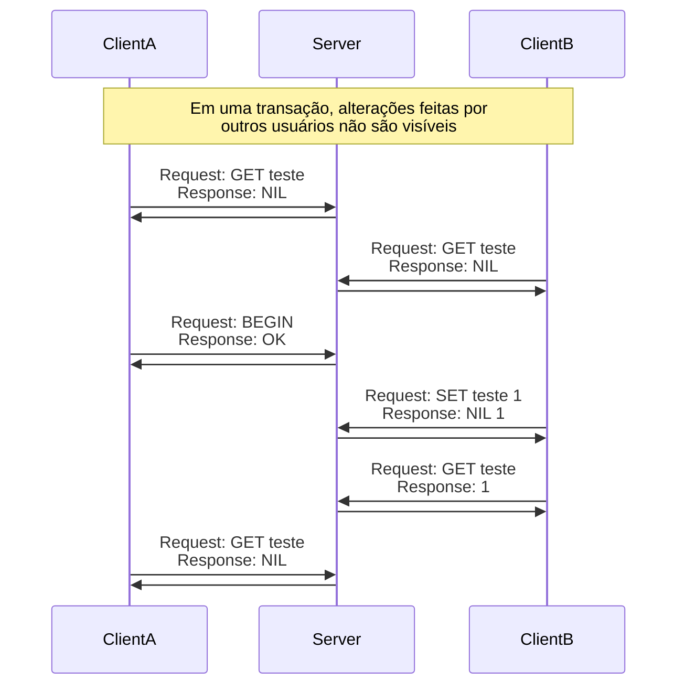
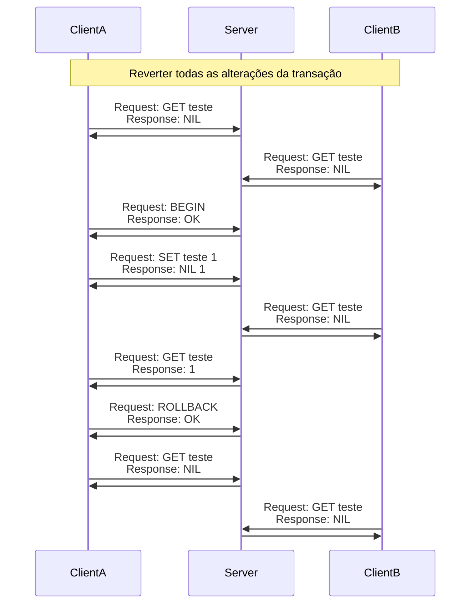
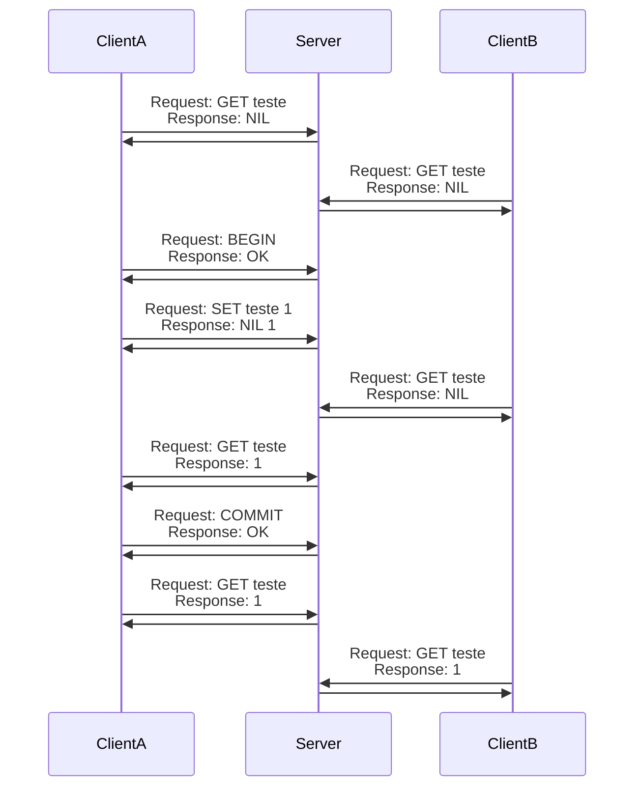
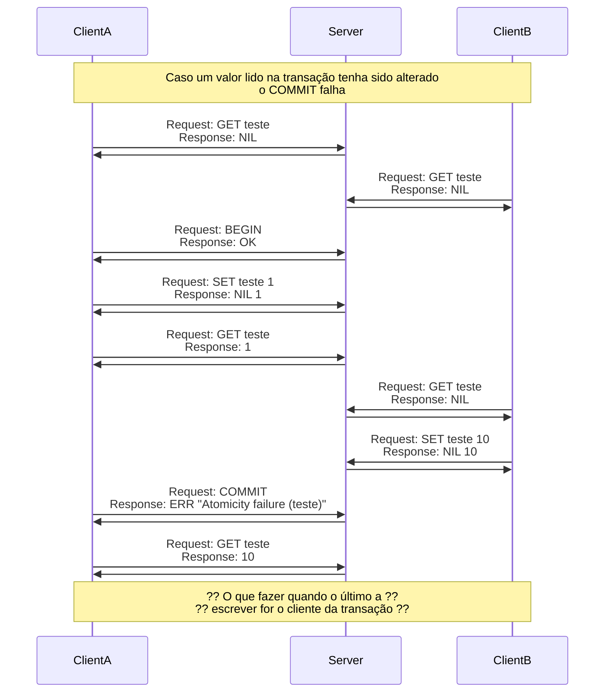

# Notas de Desenvolvimento (Implementação Geral)

Antes de elaborar uma implementação, vou listar todos os requisitos encontrados em `DESAFIO.md`

## Requisitos

### 1. Identificar ID do Cliente

Ao enviar uma requisição, o cliente deve informar o seu id de cliente.

Não foi identificado o que deve-se ser feito caso não exista nenhuma informação no header,
então optei por retornar o http status 400 caso o não exista nenhuma informação no header.

### 2. Identificar comandos no body do request

Cada comando pode ou não receber outros parâmetros. Ientificando os possíveis tipos abaixo.
Caso o comando não esteja na lista abaixo, deverá ser necessário retornar a mensagem `No command <COMMAND>`
Caso os parâmetros do comando não tenham sido informados corretamente, retornar a mensagem `<COMMAND> <...PARAMS> - Syntax Error`.

Os possíveis comandos a serem recebidos são:

- **GET** <k: `str`>
Retornar valor armazenado para a chave `k`. Retornar `NIL` caso nenhum valor seja encontrado;
- **SET** <k: `str`> <v: `TRUE | FALSE | int | str`>
Armazenar o valor `v` para a chave `k`. Caso o valor `v` seja `NIL`, retornar a resposta `ERR "Cannot SET key to NIL"`;  (Sem status http diferente?)
- **BEGIN**
Iniciar uma transação. Caso uma transação já esteja aberta, retornar a resposta `ERR "Already in transaction"`; (Sem status http diferente?)
- **ROLLBACK**
Encerrar a transação sem persistir nenhuma das alterações. retornar um erro caso nenhuma transação esteja aberta;
- **COMMIT**
Encerrar a transação aberta, persistindo os dados da transação e liberando acesso para os demais usuários. Caso alguma das chaves da transação seja alterada, retornar uma mensagem de erro `ERR "Atomicity failure (teste)`.

## Exemplos
### SET

### SET com valores incorretos

### GET

### GET com valores incorretos

### BEGIN

### ROLLBACK

### COMMIT

